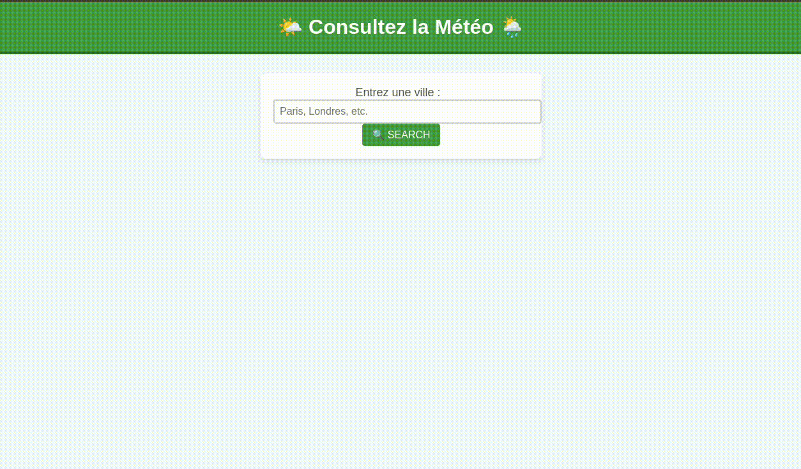

# Weather App 🌦️

For this project, I used the **OpenWeatherMap API** 🌦️, specifically the One Call API, to fetch real-time weather data. This API provides comprehensive weather information, including temperature 🌡️, humidity 💧, and weather conditions ☁️, for any given location.

To display the weather data, I developed a simple web application using **Flask** 🍃, a lightweight Python framework. The app allows users to enter the name of a city in a form, and upon submission, it displays the current weather details, such as temperature and weather description, for that city.




## Acknowledgements

 - [OpenWeatherMAP](https://openweathermap.org/s) : sign up to get an API key and a free trial


## Run Locally

**Clone the project:**

```bash
  git clone git@github.com:emilours/Weather_app.git
```

**Install dependencies:**

```bash
    python3 -m venv .venv
    source .venv/bin/activate
    pip install flask
    pip install requests
```

**Create .env and fill it with you API key:**

```bash
  API_KEY=your_api_key_here
```

**Run Locally:**

```bash
  python weatherApp.py
```

**Go on localhost:**

```bash
  http://127.0.0.1:5000
```


